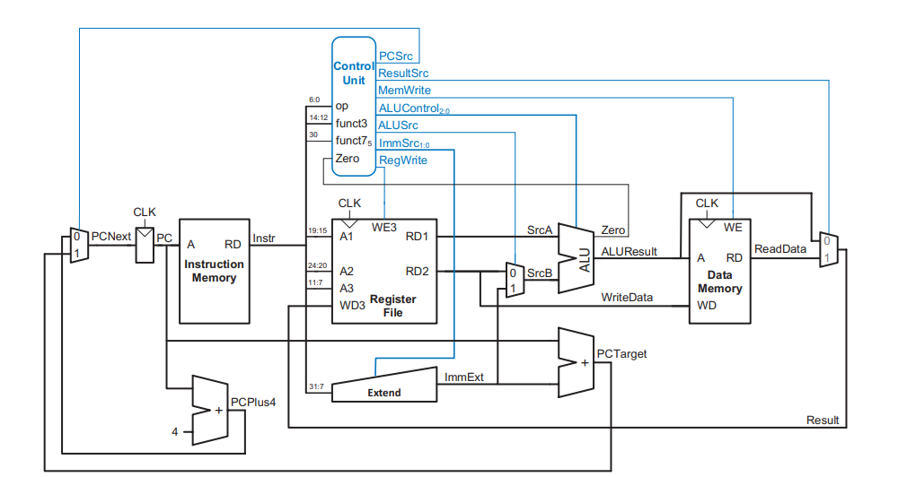
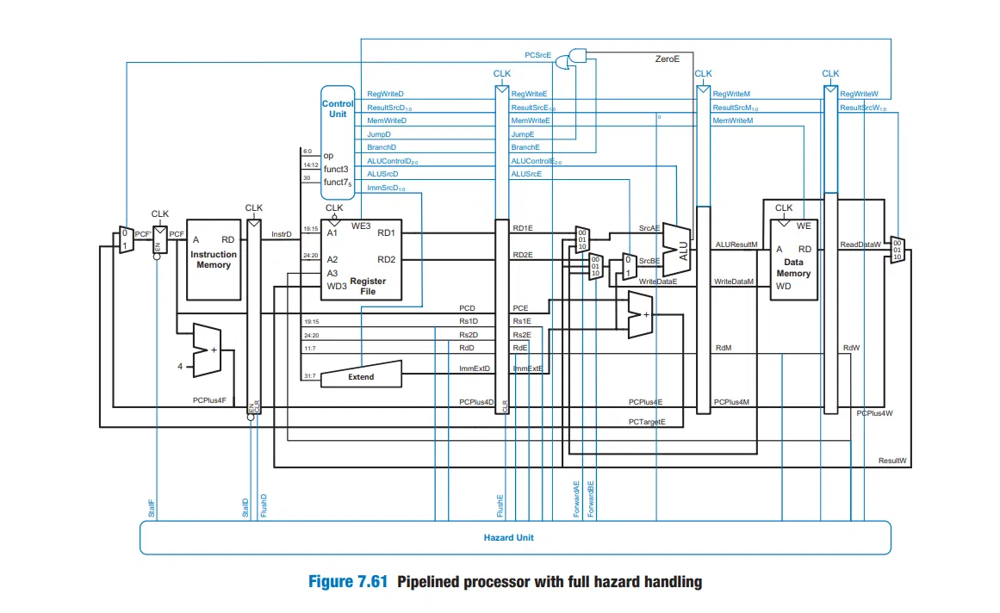

# 32-bit RV32I Processor Core Design & Verification

A comprehensive SystemVerilog realization of a 32-bit RISC-V processor core, demonstrating structural hardware design variations, pipeline optimizations, and verification methodologies across different execution models.

## Repository Architecture

This repository contains three distinct architectural implementations of the RV32I base integer instruction set, allowing for direct comparison of timing, area, control complexity, and throughput across different execution models.

```text
riscv-rv32i-core/
├── README.md                  # Main documentation landing page
├── SingleCycle.png            # Single-Cycle datapath diagram
├── Multicycle.png             # Multicycle datapath diagram
├── Pipelined.png              # Pipelined datapath diagram
├── single_cycle/              # Single-Cycle Datapath Implementation
│   ├── RTL/
│   │   ├── Top_RV32I.sv
│   │   ├── ALU.sv
│   │   ├── ALU_Control.sv
│   │   ├── Reg_File.sv
│   │   ├── inst_mem.sv
│   │   ├── data_mem.sv
│   │   ├── Decoder.sv
│   │   └── ImmGen.sv
│   └── tb/
│       └── tb_Top_RV32I.sv
├── multicycle/                # Multicycle (Von Neumann) Datapath Implementation
│   ├── RTL/
│   │   ├── Top_RV32I.sv
│   │   ├── ControlUnit.sv    # FSM Controller
│   │   ├── Inst_DataMem.sv   # Unified Memory Block
│   │   ├── Instr.sv
│   │   ├── Data.sv
│   │   └── ... (Shared arithmetic units)
│   └── tb/
│       └── tb_Top_RV32I.sv
└── pipelined/                 # Pipelined (5-Stage) Datapath Implementation
    ├── RTL/
    │   ├── Top_RV32I.sv
    │   ├── Pipeline_IF.sv     # Instruction Fetch Stage
    │   ├── Pipeline_ID.sv     # Instruction Decode Stage
    │   ├── Pipeline_EX.sv     # Execution Stage
    │   ├── Pipeline_MEM.sv    # Memory Access Stage
    │   ├── Pipeline_WB.sv     # Write-Back Stage
    │   ├── Hazard_Control.sv  # Data & Control Hazard Detection
    │   └── Pipeline_Reg.sv    # Pipeline Registers (IF/ID, ID/EX, EX/MEM, MEM/WB)
    └── tb/
        └── tb_Top_RV32I.sv

```

## Supported Instruction Set Architecture (ISA)

All three processor implementations decode and execute a core foundational subset of the RV32I unprivileged specification, covering integer arithmetic, memory load/store operations, and conditional/unconditional control-flow tracking:

| Instruction | Type | Opcode | Functionality |
| --- | --- | --- | --- |
| `add` | R-Type | `0110011` | 32-bit register-to-register addition |
| `addi` | I-Type | `0010011` | 32-bit addition with a sign-extended immediate |
| `lw` | I-Type | `0000011` | Load 32-bit word from memory array to Register File |
| `sw` | S-Type | `0100011` | Store 32-bit word from Register File to memory array |
| `beq` | B-Type | `1100011` | Conditional branch if source operand registers match |
| `jal` | J-Type | `1101111` | Unconditional jump to relative offset; stores PC+4 in `rd` |

## 🖼️ Datapath Diagrams

Visual representations of each architectural implementation are provided below:

| Single-Cycle | Multicycle | Pipelined |
| --- | --- | --- |
|  |  |  |

## Implementation Architectures

### 1. Single-Cycle Implementation

The single-cycle core maps the entire instruction cycle (Fetch, Decode, Execute, Memory, Writeback) into a single long clock period ($CPI = 1.0$).

* **Memory Structure**: Split Harvard architecture utilizing independent, dedicated Instruction Memory and Data Memory arrays.
* **Memory Optimization**: Data Memory features highly optimized combinational (asynchronous) read behavior to prevent mid-cycle structural stalls, ensuring read data is written back to the Register File on the same rising clock edge.
* **Arithmetic Core**: Employs an explicitly cast signed operator matrix (`$signed()`) within the ALU to handle correct evaluation metrics for RISC-V signed comparison instructions (`slt`).

### 2. Multicycle Implementation (Von Neumann)

The multicycle design refactors the datapath boundaries to run at a significantly higher maximum clock frequency ($F_{max}$) by splitting instruction execution into 3 to 5 clock steps depending on the instruction class.

* **Memory Structure**: Shared, unified single-memory array handling both instructions and operational payloads over a single bidirectional data bus.
* **Resource Reusability**: Optimizes hardware utilization by leveraging a single centralized ALU core to sequentially perform program counter increments, memory target calculations, and arithmetic transformations.
* **Control Unit**: Driven by a robust combinational-to-sequential Finite State Machine (FSM) that sequences through Fetch, Decode, MemAdr, MemRead, MemWB, MemWrite, Execute, and ALUWB states while preventing hazardous latch inferences.
* **Pipeline Buffers**: Uses non-architectural staging registers (`Instr`, `Data`, `A`, `WriteData`, `ALUOut`) to preserve signal values between discrete clock ticks.

### 3. Pipelined Implementation (5-Stage)

The pipelined design achieves the highest throughput by overlapping instruction execution across five distinct pipeline stages, enabling one instruction to complete per clock cycle ($CPI \approx 1.0$) at elevated clock frequencies.

* **Pipeline Stages**:
  * **IF (Instruction Fetch)**: Retrieves instruction from instruction memory using the program counter.
  * **ID (Instruction Decode)**: Decodes instruction and reads operands from the register file in parallel.
  * **EX (Execute)**: Performs arithmetic, logic, and address calculations using the ALU.
  * **MEM (Memory Access)**: Loads data from or stores data to memory using computed addresses.
  * **WB (Write-Back)**: Commits results back to the register file.

* **Hazard Mitigation**: Implements data forwarding (bypass networks) and structural hazard resolution to minimize pipeline stalls.
* **Control Flow Handling**: Manages branch prediction and pipeline flushing on misprediction.
* **Pipeline Registers**: Non-architectural staging registers (IF/ID, ID/EX, EX/MEM, MEM/WB) isolate pipeline stages to allow overlapped execution.

## Architectural Comparison: Single-Cycle vs. Multicycle vs. Pipelined

| Metric / Attribute | Single-Cycle Core Model | Multicycle Core Model | Pipelined Core Model |
| --- | --- | --- | --- |
| **Memory Architecture** | Split (Harvard Design) | Unified (Von Neumann Design) | Split (Harvard Design) |
| **Shared ALU Utilization** | Low (Requires multiple distinct adders) | High (Single ALU reused across states) | Moderate (Single ALU, Forwarding paths) |
| **CPI (Cycles Per Instruction)** | Fixed at exactly 1.0 CPI | Variable (3 to 5 cycles per instruction) | ~1.0 CPI (with hazard stalls) |
| **Critical Path Delays** | Bound by the complete sequential loop (`lw`) | Bound by the single longest execution stage | Bound by the slowest pipeline stage |
| **Target Clock Frequency** | Lower (Constrained by single-cycle limits) | Significantly Higher | **Highest** (Optimized for 5-stage pipeline) |
| **Hardware Complexity** | Low | Medium | High (Forwarding, hazard detection) |
| **Pipeline Hazards** | N/A | N/A | Data, Control, and Structural (mitigated) |

## Verification & Test Simulation Matrix

All three core microarchitectures are functionally validated using custom SystemVerilog testbenches driving specialized machine-code program payloads pre-compiled to test resource constraints and pipeline behavior.

**Test Program Sequence Flow:**

1. **State 1 & 2 (addi Verification)**: Initializes multiple individual registers sequentially with distinct non-zero values (`t0 = 5`, `t1 = 7`).
2. **State 3 (add Verification)**: Tests register-file structural read ports by computing a sum of two separate registers (`t2 = t0 + t1 = 12`).
3. **State 4 & 5 (sw / lw Cross-Verification)**: Writes the computed sum out to memory address index 0, clears interim lines, and reads the value back into register `t3` to confirm alignment and interface timing.
4. **State 6 (beq Conditional Logic)**: Performs a dynamic equality check on the source register data (`t2 == t3`). If verification passes, it forces a forward PC shift over the error routine.
5. **State 7 & 8 (jal Control Trap)**: Forces the execution path into a terminal infinite branch trap (`jal x0, pass`), locking the Program Counter in a successful execution loop to verify branch handling and target calculations.

### How to Run Simulation

1. Create a new project in your EDA simulation utility.
2. Add all design components found within the target directory's `RTL/` folder.
3. Set the respective testbench inside the `tb/` directory as the top-level verification wrapper.
4. Run the simulation. The output logs will track internal register modifications and flag hardware events via terminal printouts.

## Project Insights & Issues Resolved

* **Synchronous vs. Asynchronous Reads**: Resolved a critical single-cycle structural delay where a clocked data-memory read delayed data-bus arrival by one step. Refactored memory architectures to use combinational assignment queries.
* **FSM Optimization**: Eliminated racing conditions inside the multicycle controller block by structurally partitioning the sequential state update (`always_ff`) from the combinational control line decoder (`always_comb`).
* **Signal Truncation Fixes**: Resolved structural truncation warnings by aligning control bus bit-widths (e.g., `ResultSrc` and `ALUControl`) across modules to prevent synthesis tool optimizations from pruning required lines.
* **Pipeline Hazard Resolution**: Implemented forwarding paths and hazard detection units in the pipelined design to resolve data dependencies and prevent pipeline stalls from reducing effective throughput.
* **Structural Stall Minimization**: Optimized pipeline register widths and memory interface timing to eliminate unnecessary pipeline bubbles during back-to-back load-dependent instructions.
